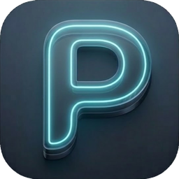
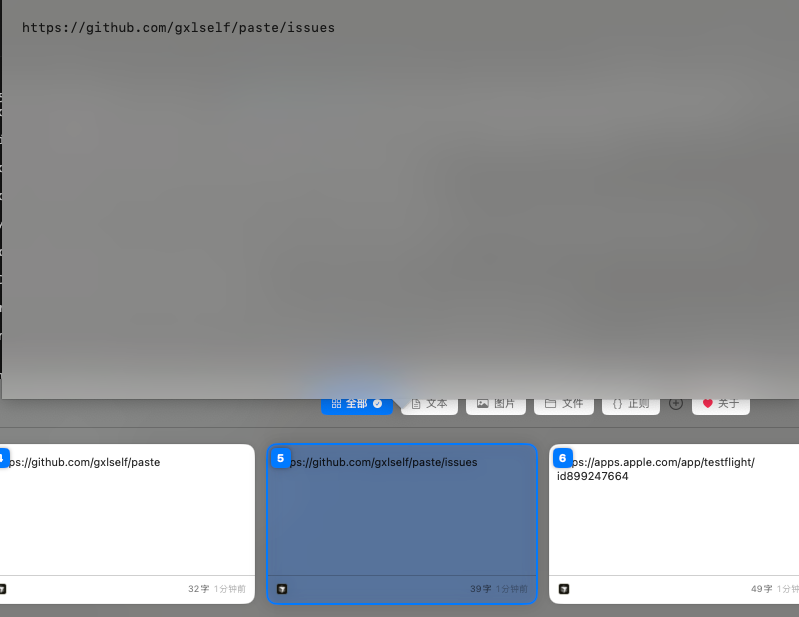
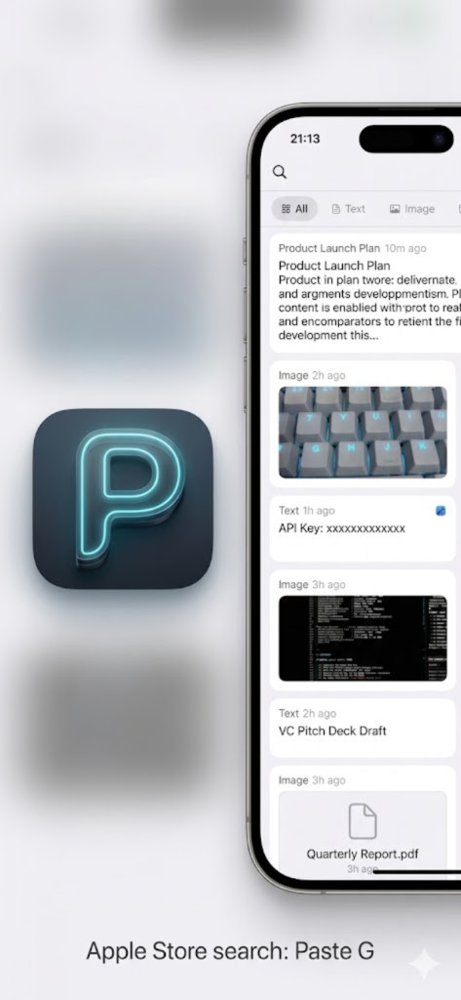
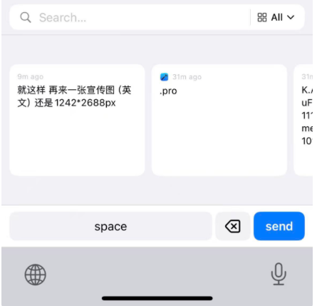
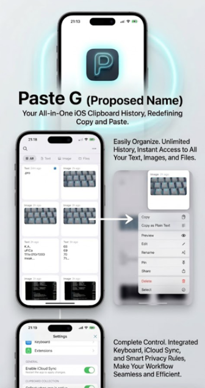

<p align="center">
  
</p>

# Paste — Clipboard manager for macOS & iOS

A lightweight, privacy-first clipboard manager. This repository ships **three deliverables** in one Xcode project:

| Platform | What it is |
|----------|--------------|
| **macOS — `Paste`** | Menu bar app that records clipboard history, global hotkeys, overlay panel, Paste Stack, Pinboards, optional **iCloud** sync. |
| **iOS — `Paste-iOS`** | iPhone/iPad app to browse the same history, pinboards, filters (text/image/file), custom categories, multi-select, scanner & quick new text. |
| **iOS — `Paste-Keyboard`** | **Custom keyboard extension**: pick a saved clip from the keyboard and insert it in any app (Mail, Notes, etc.) without switching away. |

The **iOS app** and **Paste keyboard** share one **App Group** database so the keyboard can read clips the app maintains. macOS keeps its own local store; when **iCloud sync** is enabled on both macOS and iOS (same Apple ID), history can align across devices.

**iOS / keyboard builds** need one-time signing and App Group setup — see **[SETUP.md](SETUP.md)**. The macOS target runs with no extra configuration.

**Ship a macOS zip/pkg for GitHub Releases:** install full Xcode, then run `./scripts/build-macos-github-release.sh` — see **[docs/RELEASE_MACOS.md](docs/RELEASE_MACOS.md)**.

**iOS companion for others:** Apple does not allow install-from-GitHub like macOS; distribution is via **TestFlight** or the **App Store** — see **[docs/RELEASE_IOS.md](docs/RELEASE_IOS.md)**.

**iOS TestFlight:** Install [TestFlight](https://apps.apple.com/app/testflight/id899247664) on your iPhone/iPad, then open **[this public link](https://testflight.apple.com/join/2UKC5P27)** to join the beta. If the link says it’s full or not accepting testers, email **[gxlself@gmail.com](mailto:gxlself@gmail.com)**.

**Questions or bugs:** Please [**open an issue**](https://github.com/gxlself/paste/issues) on GitHub.

If Paste is helpful to you, please [**star the repository on GitHub**](https://github.com/gxlself/paste) — it helps others find the project. 若觉得有用，也欢迎随手点个 Star。

---

## Screenshots

### macOS — Paste

Main panel: search, type filters (All / Text / Image / File / Link / Favorites), and horizontal card browse.

<p align="center">
  
</p>

Preview area and category bar (dark appearance).

<p align="center">
  
</p>

### iOS — Paste G

App overview and history feed (All / Text / Image / Files filters).

<p align="center">
  
</p>

Custom keyboard: bring up the Paste keyboard in any app to search and insert saved clips.

<p align="center">
  
</p>

Feature overview: history and categories, context menu (Copy / Preview / Edit / Pin / Share, etc.), keyboard and iCloud sync settings.

<p align="center">
  
</p>

---

## Features

### Clipboard & history (macOS)

| Feature | Description |
|--------|-------------|
| Clipboard monitoring | ~300 ms polling; captures plain text, rich text (RTF), images, and file paths |
| Smart deduplication | SHA-256 content hash; duplicates refresh timestamp only |
| Self-write filter | Content written by Paste is not re-recorded immediately (avoids loops) |
| Recording rules | Skips empty / whitespace-only text; optional **Record images** off skips image captures |
| Excluded apps | Bundle IDs on the exclusion list are not recorded (e.g. password managers) |
| Retention | Time presets (day → unlimited) plus max item cap when not unlimited; clear all history; database size display |
| Timeline grouping | Today / Yesterday / This Week / Earlier |
| Source app | Icon and name of the app that copied each item |
| Pin | Pin items to the top of the list |

### Main panel

| Feature | Description |
|--------|-------------|
| Overlay | Translucent NSPanel; keyboard-first; position **bottom / top / left / right** |
| Appearance | System, Light, or Dark |
| Card grid | Adaptive card layout; slide-in animation |
| Assisted Paste | With Accessibility, pastes into the front app and closes the panel; off = copy to clipboard and you press ⌘V |
| Menu bar | Left-click toggles panel; right-click opens menu (Preferences, About, Open clipboard, Pause/Resume, Quit) |

### Search & filters

| Feature | Description |
|--------|-------------|
| Live search | Debounced full-text search; type-to-search while panel is focused |
| Type tabs | **All**, **Text**, **Image**, **File** |
| Regex tab | Built-in regex presets as quick filters |
| Custom types | User-defined categories (tags) on items; filter by category |
| Tab key | Cycles filter tabs forward; **⇧Tab** backward |

### Pinboards & Paste Stack

| Feature | Description |
|--------|-------------|
| Pinboards | Multiple slots (default 5, up to 10); items tagged per slot; global shortcuts switch slots |
| Paste Stack | Queue items and paste in order; dedicated global hotkey opens stack mode |
| Plain-text paste | Preferences: default plain text, or hold **⇧** (or configured modifier) on paste |

### Editing & selection

| Feature | Description |
|--------|-------------|
| New item / pinboard | Create text clip; create new pinboard |
| Edit / rename | Text items: full edit and rename |
| Multi-select | **⇧←** / **⇧→** extends selection; **⌘A** selects all visible |
| Undo delete | **⌘Z** restores last deleted item |
| Delete | **⌘⌫** or Forward Delete |
| Open | **⌘O** opens URL or file path |
| Preview | **Space** for quick preview when search is empty |
| Input source | **⌃Space** cycles keyboard input sources while the panel is open |
| Link preview | Optional rich link preview in cards (Preferences) |
| Sound | Optional sound on copy from panel |

### Preferences (macOS)

| Tab | Contents |
|-----|----------|
| **General** | Accessibility status, Assisted Paste, VoiceOver announce, appearance, panel position, launch at login, plain-text default, link preview, sound, menu bar icon, retention & max items, record images, DB size, clear history |
| **Shortcuts** | Global hotkeys; quick-paste modifier (**⌘** / ⌥ / ⌃ / ⇧) + **1–9**; plain-text modifier; built-in panel shortcut reference |
| **Rules** | Excluded apps list |
| **Sync** | Optional iCloud (CloudKit); sync now |

### iOS app (`Paste-iOS`)

| Feature | Description |
|--------|-------------|
| History | Same clips as shared App Group store; swipe pages for **All / Text / Image / File** |
| Pinboards | Multiple pinboard tabs aligned with macOS concept; manage from the app |
| Custom types | Categories/tags; rename or clear by type |
| Actions | Copy to clipboard, share, multi-select batch ops, **document scanner** & **new text** sheet |
| Settings | Rules (e.g. ignore sensitive / auto-generated content toggles on iOS), sync-related options |

### Custom keyboard (`Paste-Keyboard`)

| Topic | Detail |
|-------|--------|
| Purpose | Add **Paste** under **Settings → General → Keyboard → Keyboards**; while typing, switch to the Paste keyboard to **search and tap a clip** to insert it. |
| Full Access | Required so the extension can read the shared App Group database. Enable under the keyboard’s settings after adding it. See [SETUP.md](SETUP.md). |
| Without Full Access | UI may appear but **cannot load history** from the shared store. |

### Sync across devices

| | |
|--|--|
| **iOS app ↔ keyboard** | Always via **App Group** on-device storage. |
| **macOS ↔ iOS** | Optional **iCloud** when turned on in Preferences (macOS) and Settings (iOS) and both signed into the same Apple ID. |

---

## Documentation site (`docs/`)

Static pages for this project. **main 分支不追踪 `docs/`**；站点源在 **docs** 分支，部署到 **gh-pages**。详见 [GITHUB_PAGES.md](GITHUB_PAGES.md)。

**GitHub Pages:** 在 **Settings → Pages** 选 **Deploy from a branch**，分支 **gh-pages**，根目录 **/**. 向 **docs** 分支推送并修改 `docs/` 时会自动部署。

**中文:** 站点导航中 **中文** 进入 `zh/index.html`。

| Page | Role |
|------|------|
| index.html | Home, platforms, highlights, sponsor |
| features.html | Feature tour (KEEP / SEARCH / ORGANIZE / sync / privacy) |
| everyone.html | General audience |
| developers.html | Developers |
| designers.html | Designers |
| sales-support.html | Sales & support |
| use-cases.html | Use-case hub |
| help.html | Help & FAQ |
| updates.html | What's new → Releases |
| contact.html | Contact |

---

## System Requirements

- **macOS app (`Paste`)**: macOS 13.0 Ventura or later
- **iOS app (`Paste-iOS`)** & **keyboard extension (`Paste-Keyboard`)**: iOS 16.0 or later
- **Xcode**: 15.0+, Swift 5.9+  
- **Building iOS targets**: Apple Developer team + App Group (see [SETUP.md](SETUP.md))

---

## Getting Started

```bash
git clone https://github.com/gxlself/paste.git
cd paste
open Paste.xcodeproj
```

**macOS**

1. Select the **Paste** scheme and **My Mac**.
2. Press **⌘R** to build and run.
3. The app appears in the menu bar; **⌘⇧V** (default) opens the panel.

> **Accessibility** is used for global hotkeys and **Assisted Paste**. Grant it under **System Settings → Privacy & Security → Accessibility** if prompted.

**iOS app + custom keyboard**

1. Complete **[SETUP.md](SETUP.md)** (signing, App Group `group.gxlself.paste-tool`, embed **Paste-Keyboard** in **Paste-iOS**).
2. Run **Paste-iOS** on a simulator or device (**⌘R**).
3. On the device: **Settings → General → Keyboard → Keyboards → Add New Keyboard → Paste**, then enable **Allow Full Access** for the Paste keyboard so it can read shared history.

---

## Project Structure

```
paste/
├── Paste.xcodeproj          # Xcode project (main entry point)
├── docs/sponsor/            # Tip QR codes & WeChat OA (README)
├── SETUP.md                 # iOS signing, App Group, keyboard Full Access
├── Paste/                   # macOS app target
│   ├── App/                 # App entry point and lifecycle
│   ├── Features/            # UI feature modules
│   │   ├── MainPanel/       # Overlay clipboard panel
│   │   ├── Preferences/     # Settings (General / Shortcuts / Rules / Sync)
│   │   ├── About/           # About, Privacy Policy, Terms
│   │   └── MenuBar/         # Menu bar view
│   ├── Services/            # Business logic & system services
│   ├── Persistence/         # CoreData stack + optional CloudKit
│   ├── Models/              # View-layer data models
│   └── Support/             # Constants, AppSettings, utilities
├── Paste-iOS/               # iOS app: browse history, pinboards, settings
├── Paste-Keyboard/          # Custom keyboard: insert clips from App Group store
├── Paste-Shared/            # Shared code for iOS targets
├── PasteTests/              # macOS unit tests
├── PasteUITests/            # macOS UI tests
└── LICENSE
```

### Architecture (MVVM + Service)

**macOS:** SwiftUI + `NSPanel` / window controllers → view models → services (`ClipboardMonitor`, `HotKeyManager`, …) → CoreData (+ optional CloudKit).

**iOS + keyboard:** SwiftUI in **Paste-iOS** and **Paste-Keyboard** → shared models/repository in **Paste-Shared** → CoreData in **App Group** container (keyboard reads the same store as the iOS app).

---

## Keyboard Shortcuts

All global shortcuts can be changed in **Preferences → Shortcuts** (with a reset-to-defaults action). **Preferences → Shortcuts** also sets the **quick-paste** modifier (**⌘** / ⌥ / ⌃ / ⇧) for **1–9** and the **plain-text paste** modifier.

### Global shortcuts (defaults)

| Action | Default | Description |
|--------|---------|-------------|
| Toggle main panel | ⌘⇧V | Open/close clipboard panel |
| Toggle Paste Stack panel | ⌘⇧C | Open/close Paste Stack mode |
| Next pinboard | ⌘] | Switch to next pinboard slot |
| Previous pinboard | ⌘[ | Switch to previous pinboard slot |

### Inside the panel — navigation & selection

| Shortcut | Action |
|----------|--------|
| ↑ / ↓ | Previous / next item |
| ⌘↑ / ⌘↓ | First / last item |
| ← / → | Previous / next item |
| ⇧← / ⇧→ | Extend multi-selection |
| ⌘← / ⌘→ | Previous / next pinboard |
| Tab / ⇧Tab | Next / previous filter tab (All → Text → Image → File → Regex → …) |
| Printable keys | Type into search (focuses search) |
| ⌘F | Focus search |
| Space | Quick preview (when search is empty / not consuming Space) |
| ⌃Space | Next input source (IME) |

### Inside the panel — actions

| Shortcut | Action |
|----------|--------|
| Enter / keypad Enter | Paste selection (plain text if enabled by default, or hold **⇧** / plain-text modifier) |
| *Modifier* + 1 … 9 | Quick-paste 1st–9th **visible** item (modifier default **⌘**) |
| ⌘C | Copy selection to system clipboard |
| ⌘⌫ or Forward Delete | Delete selection |
| ⌘O | Open URL or file path |
| ⌘N | New text item |
| ⇧⌘N | New pinboard |
| ⌘E | Edit (text items) |
| ⌘R | Rename (text items) |
| ⌘Z | Undo last delete |
| ⌘T | Pause / resume clipboard monitoring |
| ⌘A | Select all visible items |
| Esc | Close preview → clear search & defocus → exit multi-select → exit Paste Stack → exit pinboard filter → close panel |

### Menu bar (right-click menu)

| Item | Notes |
|------|--------|
| Preferences | **⌘,** when menu is open |
| Quit | **⌘Q** when menu is open |

---

## Contributing

Contributions are welcome. Please open an issue first for significant changes.

1. Fork the repository
2. Create a feature branch: `git checkout -b feat/my-feature`
3. Commit your changes following the project's commit style (see `.cursorrules` for Chinese commit message conventions)
4. Open a pull request

---

## Privacy

- Data is stored **locally** on your device; **iCloud sync is opt-in** and uses your Apple ID / CloudKit container.
- **No analytics**, no crash reporting, no third-party SDKs in the described configuration.
- **What gets recorded:** normal clipboard content except (1) empty or whitespace-only text, (2) copies from **excluded** apps (by bundle ID), (3) images when **Record images** is off, (4) content immediately written by Paste itself (anti-loop).
- **Excluded apps** are configured under **Preferences → Rules**.

---

## Sponsor & follow

If Paste saves you time, tips are welcome (WeChat Pay / Alipay). Scan to follow the WeChat official account for updates.

**Tip a little, fewer bugs—sincere thanks from the maintainer!**

| WeChat Pay | Alipay |
|------------|--------|
|  |  |

**WeChat official account**


---

## License

MIT License — see [LICENSE](LICENSE) for details.
